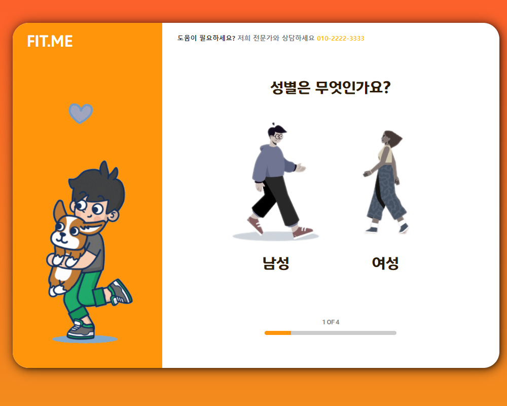
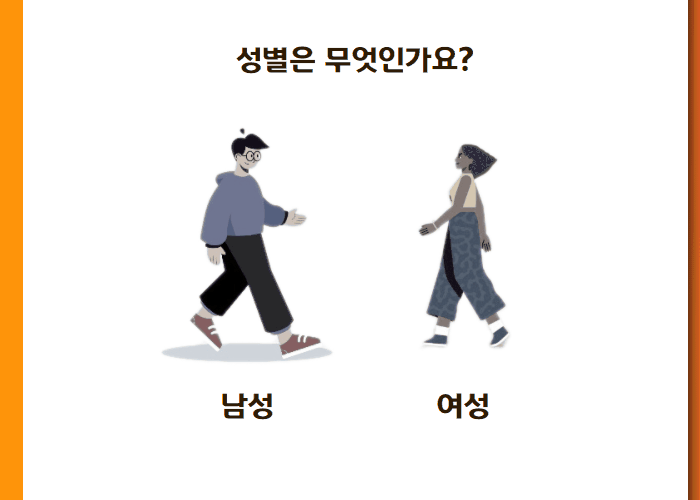
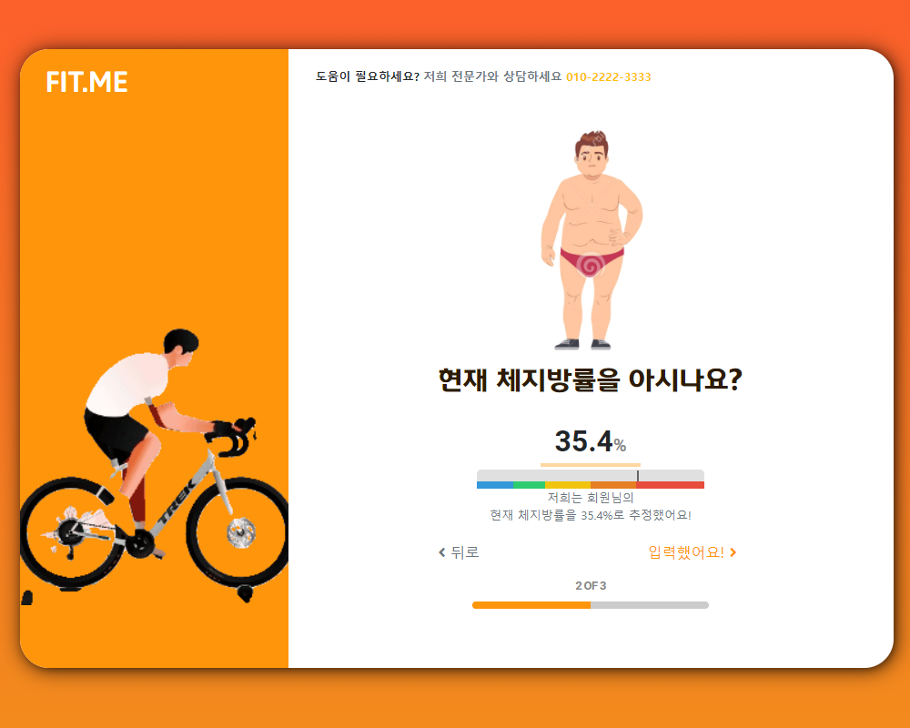

# FIT.ME

FIT.ME는 다양한 방법으로 건강 관리를 지원하는 웹 서비스입니다.

## 화면 및 소개

### 기본 정보 입력

  

- 유저가 입력 과정을 지루하게 느끼지 않도록 애니메이트된 일러스트레이션이 사이드에 위치합니다.
- 유저의 커서 움직임에 따라 선택지가 움직입니다.

### 추가 정보 입력

## 프로젝트 리뷰

### 문제점

- 무리한/비효율적 계획 과정
  그렇게 중요하지 않은 부분을 계획하는 데에 너무 많은 시간을 써서, 중요한 기능(리포트, 사용자 편의성 등)을 계획하는 데에 시간이 부족했다.
- 리소스 비일관성
  리소스를 고정된 소스를 통해 확보하지 않다보니, 리소스 간 일관성이 떨어졌다.
- 리소스의 라이센스 문제
- 코드의 재사용성
  기능적으로 재사용 가능했을 코드가 재사용되지 못했다.
- 디자인과 화면 구성의 일관성이 떨어짐
  각 화면을 개별적으로 구상하다보니 디자인과 화면 구성이 일관적이지 않았다.
- 공통 기능을 하는 요소들을 묶어내지 못함
  sass의 경우, css 선택자들이 그때그때 선언되어 사용됨으로써, 같은 스타일을 가진 선택자가 여럿 존재한다.
  js의 경우, 특징이나 기능 단위가 아니라 다른, 소스가 연결되어있어, 특징이나 기능을 공유하는 요소가 코드를 공유하지 못했다
- 설계가 갖춰지고 설계에 따라 개발하는 것이 아니라 그때그때 생각나는 기능을 끼워넣는 식으로 해서 구조가 부실해졌다
- 비슷한 기능을 하는 외부 라이브러리가 있음에도 직접 개발함에 따라 코드 작성, 테스트 등을 하는 데에 시간이 크게 소모되었다
- 주요 기능이 아닌 것을 구현하려고 하다가, 주요 기능을 구현할 시간이 부족해 구현하려던 주요 기능까지 구현하지 못했다
  수치에 따른 코멘트 제공, 리포트의 Overview만이 아닌 Activity와 Nutrition 칼럼, 입력 이어하기 및 리포트의 시각적인 힌트
- 리소스 관리 부실
  사용되지 않은 리소스를 제출 이전 삭제하지 못했고, 리소스의 네이밍에 있어 일관성이 결여되었다

### 반성과 계획
- 생각나는 기능은 일부 구현해냈지만, 생각나는대로 구현하는 것보다 처음에 계획 과정을 충분히 거친 다음 그 계획에 맞춰서 개발하는 게 더 중요할 것 같다
- 코드를 작성하고 구조화하는 데에 베스트 프랙티스와 디자인 패턴을 참고하고, 코드 리뷰를 거친 좋은 코드들을 눈에 담아봐야 할 것 같다
- 보기 좋다는 이유로 라이센스에 대한 고려 없이 무리하게 끌어쓰기보다는 활용할 수 있는 리소스를 먼저 정리한 후 그에 맞춰 최적의 선택을 해야 할 것 같다
- MVP(최소 기능 제품)과 같은 제품 개발 방법론을 접해봐야 할 것 같다
- 일정을 관리하여, 중요하지 않은 내용과 중요한 내용을 일정을 고려해가며 개발해야 할 것 같다